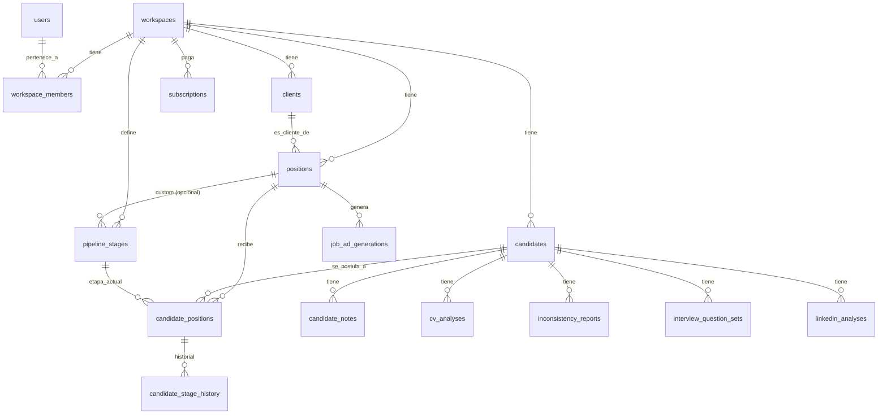

# Schema PostgreSQL v2 — RecruiterAI / ReclutarIA

Este documento acompaña a `schema.sql`. Pasa la plataforma de un analizador
de CVs stateless (todo vive en memoria, en `JobService`) a un ATS persistente
con pipeline, CRM de clientes y multi-tenancy.

## Diagrama de entidades

## Mapeo cambios de producto → tablas

| # | Cambio pedido | Tablas |
|---|---|---|
| 2 | Módulo de Postulantes | `candidates`, `candidate_notes` |
| 3 | Módulo de Posiciones/Vacantes | `positions` |
| 4 | Pipeline por etapas (kanban) | `pipeline_stages`, `candidate_positions`, `candidate_stage_history` |
| 5 | CRM de clientes (agencias) | `clients`, `positions.client_id` |
| 6 | IA transparente (por qué del score) | `cv_analyses.reasoning` (nuevo campo, antes no se guardaba) |
| 7 | Generador de avisos | `job_ad_generations` |
| 8-9 | MercadoPago + tiers | `subscriptions`, `workspaces.plan_tier` |
| 10 | Base PostgreSQL | todo este schema |
| 11 | Multi-tenancy | `workspaces`, `workspace_members` |

## Decisiones de diseño

**Multi-tenancy por `workspace_id`, no por schema separado.** Todas las
tablas de negocio (`clients`, `positions`, `candidates`, `pipeline_stages`,
`subscriptions`) cuelgan de `workspace_id`. Es más simple de operar en
Postgres gestionado (Railway/Supabase/RDS) que schema-per-tenant, y alcanza
para el tamaño de cliente esperado (agencias chicas/medianas). Cada query
del backend va a necesitar filtrar por el workspace del usuario autenticado
— esto hay que reforzarlo en el middleware/EF Core, no solo confiar en el
frontend.

**Pipeline con etapas por workspace, no hardcodeadas en código.**
`pipeline_stages` tiene un trigger (`seed_default_pipeline_stages`) que
crea automáticamente Nuevo → Screening → Entrevista → Oferta → Contratado →
Descartado al crear un workspace. `position_id` queda nullable para el día
que un cliente quiera un pipeline custom por posición (ej: agregar "Prueba
técnica"), sin tener que migrar el schema — hoy simplemente no se usa esa
columna (siempre NULL = plantilla del workspace).

**`candidate_positions` es el "card" del kanban.** Un candidato puede
postularse a varias posiciones (`UNIQUE(candidate_id, position_id)` evita
duplicados), y cada postulación tiene su propia etapa actual
(`current_stage_id`) y su historial completo en `candidate_stage_history`
para auditoría ("¿cuándo pasó a Entrevista? ¿quién lo movió?").

**Los resultados de IA se persisten por separado, no en una tabla única.**
`cv_analyses`, `inconsistency_reports`, `interview_question_sets` y
`linkedin_analyses` quedan como tablas propias en vez de una tabla
`ai_results` genérica con un campo `type` — el motivo es que cada una tiene
su propia forma y sus propios filtros de negocio (ej: querer el último
`cv_analyses` de un candidato para una posición es una query directa, no
un `WHERE type = 'ranking'` sobre una tabla gigante). El campo
`raw_response JSONB` en `cv_analyses` guarda la respuesta cruda de Claude
por si hace falta reprocesar o auditar sin volver a llamar a la API.

**`reasoning` en `cv_analyses` es el campo nuevo para IA transparente
(punto 6).** Hoy el prompt ya le pide el score a Claude pero el modelo de
`RecruitModels.cs` no tiene un campo para el "por qué" — falta pedírselo al
prompt y guardarlo acá para que el frontend lo muestre.

**`linkedin_analyses.candidate_id` es nullable.** El flujo de análisis de
LinkedIn hoy es "pegá el texto y analizá", sin pasar por crear un candidato
antes. Se permite guardar el análisis suelto y asociarlo a un candidato
después si el recruiter decide avanzar con esa persona.

**`job_ad_generations` no depende de plataforma real.** Como la API de
LinkedIn es inviable (según la investigación de mercado), esto es texto
generado por Claude para copiar/pegar manualmente — `platform` es solo un
tag informativo, no hay integración.

**Suscripciones: una tabla simple ligada 1 a 1 (hoy) con `workspace_id`.**
Si más adelante MercadoPago requiere guardar eventos de webhook para
reconciliar pagos, se agrega una tabla `subscription_events` aparte en vez
de sobrecargar esta.

## Lo que NO resuelve este schema (siguiente paso: backend)

- Entidades EF Core / `DbContext` — el `.csproj` actual no tiene `Npgsql`
  ni `Microsoft.EntityFrameworkCore` todavía.
- Migraciones (`dotnet ef migrations add InitialCreate`).
- Endpoints REST para CRUD de `candidates`, `positions`, `clients`,
  `pipeline_stages` (hoy `RecruitController` solo tiene las 4 funcionalidades
  de análisis, sin persistencia).
- Reemplazo de `JobService` (in-memory) para que los resultados de análisis
  se guarden en `cv_analyses` / `inconsistency_reports` / etc. en vez de
  vivir 30 minutos en un `ConcurrentDictionary`.
- Autenticación real (`users.password_hash` está en el schema pero hoy el
  backend usa tokens fijos en `appsettings.json` vía `Auth:ValidTokens`).

Esto queda para la siguiente etapa: armar el backend (EF Core + Npgsql +
migraciones + controllers nuevos) sobre este schema.
